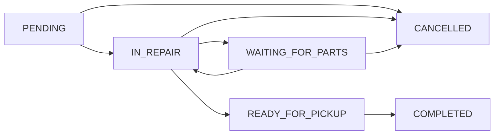

<div align="center">
    
</div>

# MossBros Backend

**Professional Motorcycle Repair Shop Management System**

A comprehensive REST API backend service built with Node.js and TypeScript for managing motorcycle repair shop operations, including customer management, service tracking, repair job workflows, and business analytics.

---

## 📋 Table of Contents

- [Features](#-features)
- [Technology Stack](#-technology-stack)
- [System Requirements](#-system-requirements)
- [Installation](#-installation)
- [Configuration](#-configuration)
- [Development](#-development)
- [API Documentation](#-api-documentation)
- [Database Schema](#-database-schema)
- [Workflow Management](#-workflow-management)
- [Deployment](#-deployment)
- [License](#-license)

---

## ✨ Features

### 🔐 **Authentication & Security**
- JWT-based authentication with HTTP-only cookies
- Bearer token support for API access
- Role-based access control
- Secure password hashing with bcrypt
- CORS configuration for cross-origin requests

### 👥 **Customer Management**
- Customer registration and profile management
- Customer-motorcycle relationship tracking
- Contact information management
- Service history tracking

### 🏍️ **Motorcycle Management**
- Motorcycle registration with plate number tracking
- Brand and model association
- Customer ownership linking
- Service history integration

### 🔧 **Service Management**
- Service catalog with pricing
- Service activation/deactivation
- Cost calculation automation
- Service-repair job associations

### 📋 **Repair Job Workflow**
- Complete repair lifecycle management
- Six-state workflow system:
  - `PENDING` → Job received, awaiting start
  - `IN_REPAIR` → Active repair work
  - `WAITING_FOR_PARTS` → Awaiting replacement parts
  - `READY_FOR_PICKUP` → Repair completed
  - `COMPLETED` → Job finished and motorcycle collected
  - `CANCELLED` → Job cancelled
- Automatic cost calculation
- Estimated completion dates
- Progress tracking with timestamps

### 📊 **Business Analytics**
- Revenue tracking and reporting
- Job completion statistics
- Service performance metrics
- Customer analytics
- Workflow efficiency monitoring

### 🗃️ **Data Management**
- Comprehensive database seeding
- Data validation and sanitization
- Relationship integrity enforcement
- Automatic timestamp management

---

## 🛠 Technology Stack

| Category | Technology | Version |
|----------|------------|---------|
| **Runtime** | Node.js | Latest |
| **Language** | TypeScript | ^5.9.3 |
| **Framework** | Express.js | ^5.1.0 |
| **Database** | PostgreSQL | 18-alpine |
| **Cache** | Redis | 8-alpine |
| **ORM** | TypeORM | ^0.3.27 |
| **Authentication** | JWT | ^9.0.2 |
| **Validation** | Express Validator | ^7.2.1 |
| **Security** | bcrypt | ^6.0.0 |
| **Development** | Nodemon + ts-node | Latest |

---

## 💻 System Requirements

- **Node.js** 18+ 
- **Docker & Docker Compose** (recommended)
- **PostgreSQL** 12+ (if running locally)
- **Redis** 6+ (if running locally)
- **npm** or **yarn**

---

## 🚀 Installation

### Option 1: Using Docker (Recommended)

```bash
# Clone the repository
git clone <repository-url>
cd mossbros/backend

# Copy environment configuration
cp .env.example .env

# Configure environment variables
nano .env

# Start services with Docker
docker-compose up -d

# Install dependencies
npm install

# Start development server
npm run dev
```

### Option 2: Local Setup

```bash
# Clone and navigate
git clone <repository-url>
cd mossbros/backend

# Install dependencies
npm install

# Set up environment variables
cp .env.example .env

# Configure your local PostgreSQL and Redis
# Update .env with your database credentials

# Start development server
npm run dev
```

---

## ⚙️ Configuration

Create a `.env` file in the root directory with the following configuration:

```env
# Application Configuration
NODE_ENV=development
PORT=4000
API_VERSION=v1

# Database Configuration
POSTGRES_HOST=localhost
POSTGRES_PORT=5432
POSTGRES_DB=mossbros_db
POSTGRES_USER=mossbros_user
POSTGRES_PASSWORD=secure_password

# Redis Configuration
REDIS_HOST=localhost
REDIS_PORT=6379
REDIS_PASSWORD=redis_password

# Authentication
JWT_SECRET=your_super_secure_jwt_secret
JWT_EXPIRES_IN=7d
COOKIE_SECRET=your_cookie_secret

# Email Configuration (Optional)
SMTP_HOST=smtp.gmail.com
SMTP_PORT=587
SMTP_USER=your_email@gmail.com
SMTP_PASS=your_email_password

# Cloudinary Configuration (For image uploads)
CLOUDINARY_CLOUD_NAME=your_cloud_name
CLOUDINARY_API_KEY=your_api_key
CLOUDINARY_API_SECRET=your_api_secret

# Security
BCRYPT_SALT_ROUNDS=12
CORS_ORIGIN=http://localhost:3000
```

---

## 🔨 Development

### Available Scripts

```bash
# Development server with hot reload
npm run dev

# Build for production
npm run build

# Lint code
npm run lint

# Fix linting issues
npm run lint:fix

# Database seeding
npm run seed
```

### Project Structure

```
mossbros-backend/
├── .env                      # Environment variables (local)
├── .gitignore               # Git ignore rules
├── .github/                 # GitHub workflows and configurations
│   └── workflows/
│       └── lint.yml         # Automated linting workflow
├── CHANGELOG                # Version history and release notes
├── LICENSE                  # Software license
├── README.md               # Project documentation
├── docker-compose.yml      # Docker services configuration
├── eslint.config.mts       # ESLint configuration
├── package.json            # Project dependencies and scripts
├── package-lock.json       # Locked dependency versions
├── tsconfig.json          # TypeScript configuration
└── src/                   # Source code directory
    ├── config/            # Application configuration
    │   ├── cors.ts        # CORS middleware configuration
    │   ├── nodemailer.ts  # Email service configuration
    │   └── typeorm.ts     # Database ORM configuration
    ├── controllers/       # Request handlers and API endpoints
    │   ├── auth.controller.ts      # Authentication endpoints
    │   ├── brand.controller.ts     # Brand management endpoints
    │   ├── customer.controller.ts  # Customer management endpoints
    │   ├── model.controller.ts     # Model management endpoints
    │   ├── repairJob.controller.ts # Repair job workflow endpoints
    │   └── service.controller.ts   # Service management endpoints
    ├── database/          # Database related functionality
    │   ├── seed.ts        # Main seeding script
    │   └── seeds/         # Individual seed files
    │       ├── index.ts           # Seed orchestration
    │       ├── brand.seed.ts      # Motorcycle brands seeding
    │       ├── customer.seed.ts   # Customer data seeding
    │       ├── model.seed.ts      # Motorcycle models seeding
    │       ├── motorcycle.seed.ts # Motorcycle data seeding
    │       ├── repairJob.seed.ts  # Repair job data seeding
    │       └── user.seed.ts       # User data seeding
    ├── entities/          # TypeORM database entities
    │   ├── index.ts           # Entity exports
    │   ├── Brand.entity.ts    # Motorcycle brand entity
    │   ├── Customer.entity.ts # Customer information entity
    │   ├── Model.entity.ts    # Motorcycle model entity
    │   ├── Motorcycle.entity.ts # Motorcycle registration entity
    │   ├── RepairJob.entity.ts   # Repair job workflow entity
    │   ├── Service.entity.ts     # Repair service entity
    │   └── User.entity.ts        # System user entity
    ├── enums/             # Application enumerations
    │   └── index.ts       # Repair status and other enums
    ├── handler/           # Error handling utilities
    │   └── error.handler.ts # Custom error classes and handlers
    ├── middleware/        # Express middleware functions
    │   ├── auth.ts        # JWT authentication middleware
    │   ├── error.ts       # Global error handling middleware
    │   └── validation.ts  # Request validation middleware
    ├── routes/            # API route definitions
    │   ├── auth.ts        # Authentication routes
    │   ├── brands.ts      # Brand management routes
    │   ├── customers.ts   # Customer management routes
    │   ├── models.ts      # Model management routes
    │   ├── repairJobs.ts  # Repair job workflow routes
    │   └── services.ts    # Service management routes
    ├── services/          # Business logic layer
    │   ├── auth.service.ts      # Authentication business logic
    │   ├── brand.service.ts     # Brand management logic
    │   ├── customer.service.ts  # Customer management logic
    │   ├── model.service.ts     # Model management logic
    │   ├── repairJob.service.ts # Repair job workflow logic
    │   └── service.service.ts   # Service management logic
    ├── types/             # TypeScript type definitions
    │   └── index.ts       # Application-wide type definitions
    ├── utils/             # Utility functions
    │   ├── bcrypt.ts      # Password hashing utilities
    │   └── token.ts       # JWT token utilities
    ├── index.ts           # Application entry point
    └── server.ts          # Express server configuration
```

### Key Directories Explained

- **`config/`** - Contains all application configuration files for different services
- **`controllers/`** - HTTP request handlers that process incoming API requests
- **`database/`** - Database setup, migrations, and seeding functionality
- **`entities/`** - TypeORM entity definitions that map to database tables
- **`enums/`** - Shared enumerations used across the application
- **`handler/`** - Centralized error handling and custom error classes
- **`middleware/`** - Express middleware for authentication, validation, and error handling
- **`routes/`** - API route definitions with validation and middleware configuration
- **`services/`** - Business logic layer containing core application functionality
- **`types/`** - TypeScript type definitions for better type safety
- **`utils/`** - Reusable utility functions for common operations

---

## 📚 API Documentation

### Base URL
```
http://localhost:4000/api/v1
```

### Authentication Endpoints
| Method | Endpoint | Description |
|--------|----------|-------------|
| `POST` | `/auth/login` | User login |
| `POST` | `/auth/logout` | User logout |
| `GET` | `/auth/verify` | Verify token |
| `GET` | `/auth/profile` | Get user profile |

### Brand Management
| Method | Endpoint | Description |
|--------|----------|-------------|
| `POST` | `/brands` | Create brand |
| `GET` | `/brands` | List all brands |
| `GET` | `/brands/:id` | Get brand by ID |
| `PUT` | `/brands/:id` | Update brand |
| `DELETE` | `/brands/:id` | Delete brand |

### Model Management
| Method | Endpoint | Description |
|--------|----------|-------------|
| `POST` | `/models` | Create model |
| `GET` | `/models/:brand_id` | List models by brand |
| `GET` | `/models/:brand_id/:id` | Get specific model |
| `PUT` | `/models/:id` | Update model |
| `DELETE` | `/models/:id` | Delete model |

### Customer Management
| Method | Endpoint | Description |
|--------|----------|-------------|
| `POST` | `/customers` | Create customer |
| `GET` | `/customers` | List all customers |
| `GET` | `/customers/:id` | Get customer by ID |
| `PUT` | `/customers/:id` | Update customer |
| `DELETE` | `/customers/:id` | Delete customer |

### Service Management
| Method | Endpoint | Description |
|--------|----------|-------------|
| `POST` | `/services` | Create service |
| `GET` | `/services` | List all services |
| `GET` | `/services/:id` | Get service by ID |
| `PUT` | `/services/:id` | Update service |
| `DELETE` | `/services/:id` | Delete service |

### Repair Job Management
| Method | Endpoint | Description |
|--------|----------|-------------|
| `POST` | `/repair-jobs` | Create repair job |
| `GET` | `/repair-jobs` | List repair jobs (with filters) |
| `GET` | `/repair-jobs/statistics` | Get business statistics |
| `GET` | `/repair-jobs/:id` | Get repair job details |
| `PUT` | `/repair-jobs/:id` | Update repair job |
| `PATCH` | `/repair-jobs/:id/status` | Update job status |
| `PATCH` | `/repair-jobs/:id/cancel` | Cancel repair job |
| `GET` | `/repair-jobs/:id/workflow` | Get workflow information |
| `DELETE` | `/repair-jobs/:id` | Delete repair job |

### Sample API Requests

#### Create Repair Job
```json
POST /api/v1/repair-jobs
Authorization: Bearer <token>
Content-Type: application/json

{
    "motorcycle_id": "uuid-here",
    "service_ids": ["service-uuid-1", "service-uuid-2"],
    "notes": "Customer reported brake issues",
    "estimated_completion": "2025-10-25T10:00:00Z"
}
```

#### Update Job Status
```json
PATCH /api/v1/repair-jobs/:id/status
Authorization: Bearer <token>
Content-Type: application/json

{
    "status": "in_repair"
}
```

---

## 🗄️ Database Schema

### Core Entities

- **Users**: System administrators and mechanics
- **Customers**: Motorcycle owners
- **Motorcycles**: Customer vehicles with brand/model
- **Brands**: Motorcycle manufacturers
- **Models**: Specific motorcycle models per brand
- **Services**: Available repair services with pricing
- **RepairJobs**: Work orders with workflow states

### Key Relationships

- Customer ↔ Motorcycle (One-to-One)
- Brand ↔ Model (One-to-Many)  
- Motorcycle ↔ RepairJob (One-to-Many)
- RepairJob ↔ Service (Many-to-Many)

---

## 🔄 Workflow Management

### Repair Job States



### Business Rules

- **Cost Calculation**: Automatic based on selected services
- **Estimated Completion**: Smart calculation with complexity factors
- **Status Transitions**: Validated state machine
- **Cancellation**: Allowed only in specific states
- **Timestamps**: Automatic tracking of key milestones

---

## 🚀 Deployment

### Production Environment

1. **Environment Setup**
```bash
# Set production environment
NODE_ENV=production

# Use production database
POSTGRES_HOST=your-production-db-host
```

2. **Build Application**
```bash
npm run build
```

3. **Process Management** (PM2 recommended)
```bash
npm install -g pm2
pm2 start dist/index.js --name mossbros-backend
```

### Docker Production Deployment

```yaml
# docker-compose.prod.yml
version: '3.8'
services:
  app:
    build: .
    ports:
      - "4000:4000"
    environment:
      NODE_ENV: production
    depends_on:
      - postgres
      - redis
```

---

## 📄 License

**Private License** - © 2025 iDesign. All rights reserved.

This software is proprietary and confidential. Unauthorized copying, distribution, or use is strictly prohibited.

---

## 📧 Support

For technical support or business inquiries:

- **Technical Issues**: Contact your system administrator
- **Business Inquiries**: Contact MossBros management
- **Documentation**: This README and inline code comments

---

**Built with ❤️ by iDesign**